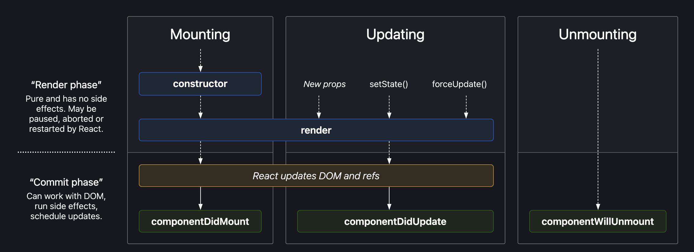

# REACT

## React Fragment

## Props

## Reconciliation

## React Hooks

- **useState** :

hook from react library provides a way to create state variables inside components. *useHook* returns a **state variable** and a **callback function** that can be used to update the value of the variable.

> [!Note]
> Everytime the value of the variable is updated react re-renders the component.

``` javascript
    import { useState } from "react";

    const HomeComponent = () => {
        // Create a state variable with initial value using useState
        const [count, setCount] = useState(0);
        return (
            <h1>Home</h1>
            <h2>{count}</h2>
            <button onClick={() => {
                setCount(count+1)
            }}>
        );
    }
```

- **useEffect** :

hook from react library provides a way to call the external APIs and update the states.

- For the first time when component loads useEffect is called after the initial render.
- useEffect will be called everytime if there is a change in the value of it's dependencies.

``` javascript
    import { useEffect } from "react";

    const HomeComponent = () => {
        const [searchText, setSearchText] = useState("");
        // The hook will only be called once after the initial render, 
        // since there are no dependencies
        useEffect(() => {
            fetch("https://google.com");
        }, []);

        // The hook in addition to initail call will also be called 
        // everytime there is a change in the value of search text
        useEffect(() => {
            // Logic to fetch search results...
        }, [searchText]);

        return (
            <>
                {/*JSX to update search text*/}
            </>
        )
    }
```


## Custom Hooks
Custom hooks at the end of the day are nothing but simple function with one or more *states* in them.
 - Hooks are named starting with **use**.
 - Hooks can return anything state, callbacks, null etc.

Ex:-

``` javascript
    import { useState, useEffect } from "react";

    const useIsOnline = () => {
        const [isOnline, setIsOnline] = useState(true);
        
        useEffect(() => {
            onlineListener = window.addEventListener("online", () => setIsOnline(true));
            offlineListener = window.addEventListener("offline", () => setIsOnline(false));

            // Returning a callback to cleanup the listeners added after the
            // component is no longer in use
            return () => {
                window.removeEventListener("online", onlineListener);
                window.removeEventListener("offline", offlineListener);
            }
        }, [isOnline])

        return isOnline;
    }
```

## React Router

### React Router Hooks
- **useParams**
    Hook to read the path parameters.
- **useRouteError**

## Contexts
Contexts are in a way centralized storage mechanism provided by react. Contexts can be used to access the data
from any component.

``` javascript
    // UserContext.js file
    import { createContext } from "react";

    const UserContext = createContext({
        user: {
            "name": "Dummy Name",
            "email": "dummyemail@gmail.com"
        }
    });

    // HomeComponent.js
    import { useContext } from "react";
    import { UserContext } from "./UserContext";

    const HomeComponent = () => {
        // We can access the user context by using use context metchod
        const { user } = useContext(UserContext);
    }

    // App.js
    import { UserContext } from "./UserContext";

    const App = () => {
        const {user, setUser} = useState({
            "name": "Bharat",
            "email": "bharat@gmail.com"
        })
        // Using context.Provider will override the default value of the context
        // and all the children components can access this new value set by their parent
        // by using the context.
        <UserContext.Provider value={{user: user}}>
            <HomeComponent />
        </UserContext>
    }
```

## Component Lifecycle

Component Lifecycle explains how a component is mounted (loaded), rendered, updated and then unmmounted from DOM.



The image above gives a overview of the componect lifecycle.